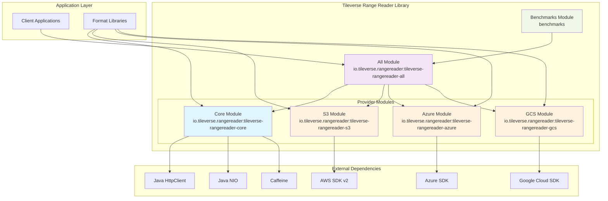

# Container View

## Overview

The Tileverse Range Reader library follows a **modular architecture** that enables incremental adoption and minimal dependency footprint. Each module serves a specific purpose and can be used independently or in combination with others.

## Container Diagram


The container view shows the modular structure of the library, with the core module providing fundamental abstractions and cloud provider modules adding specific storage backend support.

## High-Level Container Structure



## Container Details

### Core Module (`tileverse-rangereader-core`)

**Purpose**: Provides fundamental abstractions, base implementations, and decorators.

**Key Responsibilities**:
- Core `RangeReader` interface definition
- Abstract base classes with common functionality
- Local file system implementation (`FileRangeReader`)
- HTTP/HTTPS implementation (`HttpRangeReader`)
- Performance decorators (caching, block alignment, disk caching)
- Authentication framework for HTTP sources

**Key Components**:
```java
// Core abstraction
public interface RangeReader extends Closeable {
    int readRange(long offset, int length, ByteBuffer buffer);
    ByteBuffer readRange(long offset, int length);
    long size();
}

// Base implementation
public abstract class AbstractRangeReader implements RangeReader {
    // Template method pattern with common validation and buffer management
}

// Concrete implementations
public class FileRangeReader extends AbstractRangeReader { /* ... */ }
public class HttpRangeReader extends AbstractRangeReader { /* ... */ }

// Decorators
public class CachingRangeReader extends AbstractRangeReader { /* ... */ }
public class DiskCachingRangeReader extends AbstractRangeReader { /* ... */ }
public class BlockAlignedRangeReader extends AbstractRangeReader { /* ... */ }
```

**Dependencies**: Java 17+, Caffeine (caching), SLF4J (logging)

### Cloud Provider Modules

#### S3 Module (`tileverse-rangereader-s3`)

**Purpose**: Amazon S3 and S3-compatible storage support.

**Key Features**:
- Native AWS SDK v2 integration
- Full AWS credential chain support
- S3-compatible storage (MinIO, LocalStack)
- Configurable regions and endpoints

```java
public class S3RangeReader extends AbstractRangeReader {
    public static Builder builder() { /* ... */ }
    
    public static class Builder {
        public Builder uri(URI s3Uri) { /* ... */ }
        public Builder region(Region region) { /* ... */ }
        public Builder credentialsProvider(AwsCredentialsProvider provider) { /* ... */ }
        public S3RangeReader build() { /* ... */ }
    }
}
```

**Dependencies**: Core module, AWS SDK v2

#### Azure Module (`tileverse-rangereader-azure`)

**Purpose**: Microsoft Azure Blob Storage support.

**Key Features**:
- Azure SDK integration
- Multiple authentication methods (connection strings, SAS tokens, Azure AD)
- Blob service optimization

```java
public class AzureBlobRangeReader extends AbstractRangeReader {
    public static Builder builder() { /* ... */ }
    
    public static class Builder {
        public Builder uri(URI azureUri) { /* ... */ }
        public Builder connectionString(String connectionString) { /* ... */ }
        public Builder sasToken(String sasToken) { /* ... */ }
        public AzureBlobRangeReader build() { /* ... */ }
    }
}
```

**Dependencies**: Core module, Azure SDK

#### GCS Module (`tileverse-rangereader-gcs`)

**Purpose**: Google Cloud Storage support.

**Key Features**:
- Google Cloud SDK integration
- Service account authentication
- S3-compatible API support

```java
public class GoogleCloudStorageRangeReader extends AbstractRangeReader {
    public static Builder builder() { /* ... */ }
    
    public static class Builder {
        public Builder uri(URI gcsUri) { /* ... */ }
        public Builder credentials(ServiceAccountCredentials credentials) { /* ... */ }
        public GoogleCloudStorageRangeReader build() { /* ... */ }
    }
}
```

**Dependencies**: Core module, Google Cloud SDK

### All Module (`tileverse-rangereader-all`)

**Purpose**: Convenience aggregation module that provides unified access to all functionality.

**Key Features**:
- Single dependency for full functionality
- Unified builder and factory patterns
- Legacy compatibility layer

```java
// Unified factory approach
public class RangeReaderFactory {
    public static RangeReader fromUri(String uri) {
        if (uri.startsWith("s3://")) return createS3Reader(uri);
        if (uri.startsWith("azblob://")) return createAzureReader(uri);
        if (uri.startsWith("gs://")) return createGcsReader(uri);
        if (uri.startsWith("http://") || uri.startsWith("https://")) 
            return createHttpReader(uri);
        return createFileReader(uri);
    }
}

// Legacy builder (deprecated but maintained for compatibility)
@Deprecated
public class RangeReaderBuilder {
    public static S3Builder s3(URI uri) { /* ... */ }
    public static HttpBuilder http(URI uri) { /* ... */ }
    // etc.
}
```

**Dependencies**: All provider modules

### Benchmarks Module (`benchmarks`)

**Purpose**: Performance testing and optimization analysis.

**Key Features**:
- JMH-based microbenchmarks
- TestContainers integration for realistic testing
- Performance regression detection
- Different backend comparison

```java
@BenchmarkMode(Mode.AverageTime)
@State(Scope.Benchmark)
public class RangeReaderBenchmark {
    @Benchmark
    public void fileRangeReading() { /* ... */ }
    
    @Benchmark
    public void s3RangeReading() { /* ... */ }
    
    @Benchmark
    public void cachedRangeReading() { /* ... */ }
}
```

**Dependencies**: All module, JMH, TestContainers

## Module Dependency Strategy

### Incremental Adoption

The modular structure enables **incremental adoption**:

```xml
<!-- Minimal footprint: local files and HTTP only -->
<dependency>
    <groupId>io.tileverse.rangereader</groupId>
    <artifactId>tileverse-rangereader-core</artifactId>
</dependency>

<!-- Add S3 support -->
<dependency>
    <groupId>io.tileverse.rangereader</groupId>
    <artifactId>tileverse-rangereader-s3</artifactId>
</dependency>

<!-- Full functionality -->
<dependency>
    <groupId>io.tileverse.rangereader</groupId>
    <artifactId>tileverse-rangereader-all</artifactId>
</dependency>
```

### Isolation of Concerns

Each module has **clear boundaries**:
- **Core**: Foundation and local/HTTP access
- **Cloud Modules**: Provider-specific implementations
- **All**: Convenience and legacy compatibility
- **Benchmarks**: Performance analysis (not shipped)

### Extension Points

The architecture provides **extension points** for:
- New storage backends (implement `AbstractRangeReader`)
- Custom authentication (implement `HttpAuthentication`)
- Additional decorators (extend decorator pattern)
- Format-specific optimizations (build on core abstractions)

## Interface Contracts

### Between Modules

All cloud provider modules follow the same contract:
1. Extend `AbstractRangeReader` from core
2. Provide fluent builder pattern
3. Handle provider-specific authentication
4. Map provider exceptions to standard `IOException` hierarchy
5. Support URI-based configuration

### With External Systems

- **Cloud Providers**: Use official SDKs with standard retry and error handling
- **HTTP Servers**: Implement RFC 7233 range requests with fallback strategies
- **File System**: Use Java NIO for efficient local access
- **Format Libraries**: Provide clean `RangeReader` abstraction without leaking implementation details

This modular approach allows the library to serve as the **unified I/O foundation** that the Java geospatial ecosystem has been missing, while maintaining flexibility and minimal dependency overhead.
