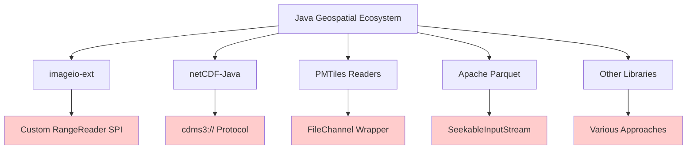
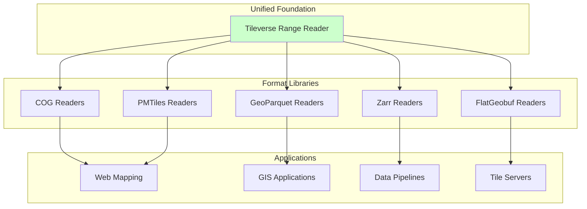
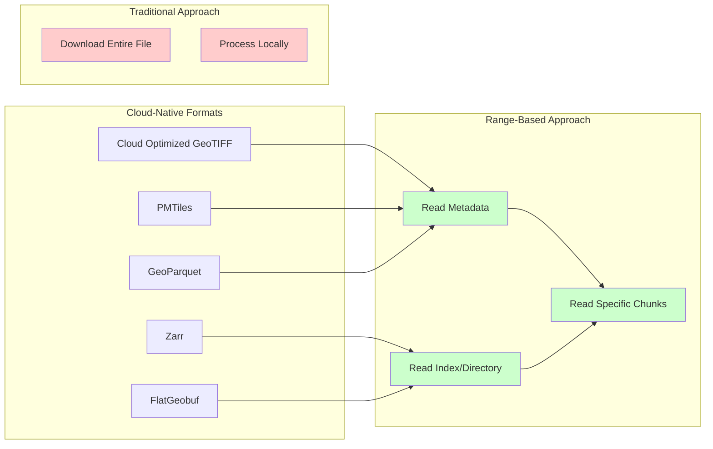

# System Context

## Business Context

### The Ecosystem Problem

The Tileverse Range Reader library exists to solve a critical architectural gap in the Java geospatial ecosystem. The domain has shifted from traditional "download-and-process" workflows to **cloud-native data access patterns**, but Java lacks a unified abstraction layer comparable to Python's **fsspec**.

## System Context Diagram


The system context diagram shows how the Tileverse Range Reader library fits into the broader ecosystem, connecting applications and developers to various data sources through a unified interface.

### Current Ecosystem Fragmentation

Each major Java geospatial library has developed its own isolated I/O solution:



This fragmentation creates:
- **Code duplication** across projects
- **Inconsistent APIs** for similar operations
- **High barriers** for new format development
- **Vendor lock-in** to specific cloud providers

### Our Solution Context



## Technical Context

### External Systems and Interfaces

The library interfaces with multiple external systems and data sources:

#### Cloud Storage Providers

| Provider | Interface | Authentication | Capabilities |
|----------|-----------|----------------|--------------|
| **Amazon S3** | AWS SDK v2 | IAM, Credentials Chain | Range requests via GetObject |
| **Google Cloud Storage** | Google Cloud SDK / S3 API | Service Accounts, ADC | Native or S3-compatible API |
| **Azure Blob Storage** | Azure SDK / S3 API | SAS, Connection Strings, AD | Native or S3-compatible API |
| **Generic HTTP/HTTPS** | Java HttpClient | Basic, Bearer, API Key, Digest | Range header support |
| **Local File System** | Java NIO | File system permissions | RandomAccessFile operations |

#### Data Format Context

The library serves as an I/O foundation for cloud-native geospatial formats:



### Integration Interfaces

#### For Library Authors

```java
// Simplified integration for format libraries
public class MyFormatReader {
    private final RangeReader source;
    
    public MyFormatReader(RangeReader source) {
        this.source = source;
    }
    
    public MyData readData(Query query) {
        // Focus on format logic, not I/O plumbing
        ByteBuffer header = source.readRange(0, headerSize);
        ByteBuffer data = source.readRange(dataOffset, dataSize);
        return parseData(header, data);
    }
}
```

#### For Application Developers

```java
// Unified API across all storage backends
RangeReader s3Reader = S3RangeReader.builder()
    .uri(URI.create("s3://bucket/data.cog"))
    .build();
    
RangeReader httpReader = HttpRangeReader.builder()
    .uri(URI.create("https://example.com/data.pmtiles"))
    .build();
    
// Same interface, different backends
processData(s3Reader);
processData(httpReader);
```

### External Dependencies and Constraints

#### Required Dependencies

| Component | Purpose | Constraint |
|-----------|---------|------------|
| **Java 17+** | Runtime platform | Minimum language level |
| **AWS SDK v2** | S3 connectivity | S3 module only |
| **Azure SDK** | Azure Blob connectivity | Azure module only |
| **Google Cloud SDK** | GCS connectivity | GCS module only |
| **Caffeine** | Memory caching | Core caching implementation |

#### Optional Dependencies

| Component | Purpose | Usage |
|-----------|---------|-------|
| **TestContainers** | Integration testing | Development/CI only |
| **Docker** | Service emulation | Testing environments |
| **SLF4J** | Logging abstraction | Runtime logging |

### Communication Protocols

#### HTTP Range Requests (RFC 7233)

```http
GET /data.cog HTTP/1.1
Host: example.com
Range: bytes=1000-1999

HTTP/1.1 206 Partial Content
Content-Range: bytes 1000-1999/50000
Content-Length: 1000
Accept-Ranges: bytes

[1000 bytes of data]
```

#### Cloud Provider APIs

- **S3**: `GetObject` with `Range` parameter
- **GCS**: S3-compatible API or native JSON API
- **Azure**: Blob service with range headers

### Stakeholder Communication

| Stakeholder | Communication Channel | Information Need |
|-------------|----------------------|------------------|
| **Java Developers** | Documentation, Examples | Integration patterns, performance tuning |
| **Library Authors** | API Reference, Extensions | Stable interfaces, extension points |
| **DevOps Teams** | Configuration Guides | Deployment, monitoring, troubleshooting |
| **Performance Engineers** | Benchmarks, Profiling | Optimization opportunities, bottlenecks |
| **Security Teams** | Security Documentation | Authentication, authorization, compliance |
