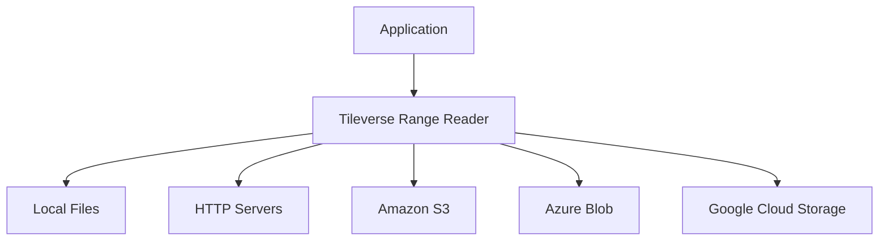
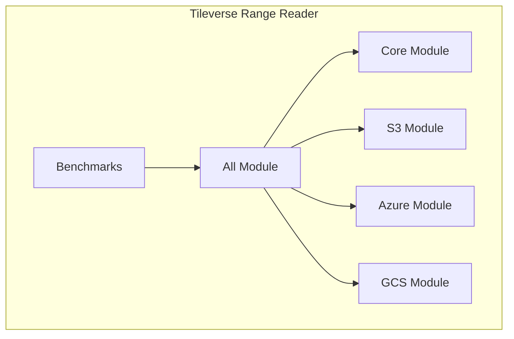
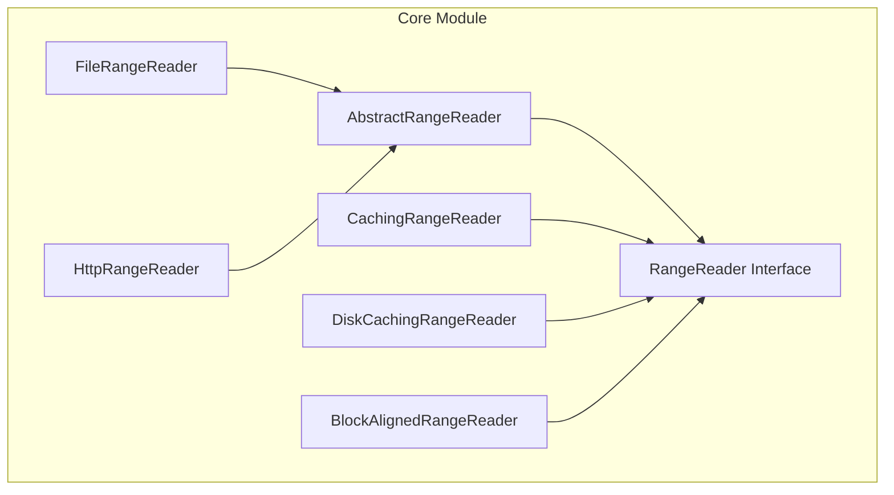

# Technical Documentation (arc42)

This section contains the comprehensive technical documentation for the Tileverse Range Reader library, structured according to the [arc42 template](https://arc42.org/) for software architecture documentation.

## About arc42

arc42 is a proven template for software architecture documentation. It provides a clear structure for documenting software architectures in a systematic and comprehensive way. This documentation follows the arc42 template to ensure consistency and completeness.

## Documentation Structure

The technical documentation is organized into the following sections:

### 1. [Introduction and Goals](introduction.md)
- Requirements overview and context
- Quality goals and constraints
- Stakeholder analysis

### 2. [Architecture Constraints](introduction.md)
- Technical, organizational, and political constraints
- Conventions and standards

### 3. [System Context](context-view.md)
- Business and technical context
- External interfaces and dependencies

### 4. [Solution Strategy](introduction.md)
- Fundamental decisions and solution approaches
- Technology choices

### 5. [Building Block View](container-view.md)
- Static decomposition of the system
- Container and component views

### 6. [Runtime View](runtime-view.md)
- Behavior and interaction scenarios
- Important runtime processes

### 7. [Deployment View](deployment-view.md)
- Technical infrastructure
- Mapping of software to hardware

### 8. [Crosscutting Concepts](crosscutting.md)
- Regulations and solutions for recurring or system-wide topics

### 9. [Architecture Decisions](decisions.md)
- Important, expensive, risky or critical decisions
- ADRs (Architecture Decision Records)

### 10. [Quality Requirements](quality-requirements.md)
- Quality tree with scenarios and priorities
- Quality scenarios and acceptance criteria

### 11. [Risks and Technical Debt](risks.md)
- Known technical risks
- Technical debt and mitigation strategies

### 12. [Glossary](glossary.md)
- Definitions of important domain and technical terms

## Target Audience

This technical documentation is primarily intended for:

- **Software Architects** designing systems that integrate the library
- **Technical Leaders** making technology decisions
- **Senior Developers** understanding implementation details
- **Quality Engineers** analyzing non-functional requirements
- **Operations Teams** deploying and monitoring applications

## Key Architectural Highlights

### Design Patterns

The library extensively uses proven design patterns:

- **Decorator Pattern**: For composable functionality (caching, block alignment)
- **Template Method**: For consistent behavior across implementations
- **Builder Pattern**: For fluent, type-safe configuration
- **Factory Pattern**: For creating readers from URIs

### Quality Attributes

The architecture prioritizes these quality attributes:

- **Performance**: Multi-level caching and optimization strategies
- **Extensibility**: Easy addition of new data sources and decorators
- **Reliability**: Robust error handling and resilience patterns
- **Usability**: Clean APIs and comprehensive documentation
- **Maintainability**: Clear separation of concerns and testable design

### Technology Choices

Key technology decisions include:

- **Java 17+**: Modern Java features with LTS support
- **NIO Channels**: High-performance I/O operations
- **Caffeine**: High-performance caching library
- **AWS/Azure/GCS SDKs**: Native cloud provider integration
- **TestContainers**: Realistic integration testing

## Architectural Views

### System Context


### Container View


### Component View (Core Module)


## Documentation Navigation

The arc42 documentation is designed to be read in sequence, but you can also jump to specific sections based on your interests:

<div class="grid cards" markdown>

-   :material-bullseye-arrow: **Goals & Context**

    ---

    Start here to understand the purpose and scope

    [:octicons-arrow-right-24: Introduction](introduction.md)

-   :material-sitemap: **Architecture Views**

    ---

    Explore the structural decomposition

    [:octicons-arrow-right-24: Container View](container-view.md)

-   :material-play-circle: **Runtime Behavior**

    ---

    Understand how the system behaves at runtime

    [:octicons-arrow-right-24: Runtime View](runtime-view.md)

-   :material-shield-check: **Quality & Risks**

    ---

    Review quality requirements and risk assessment

    [:octicons-arrow-right-24: Quality Requirements](quality-requirements.md)

</div>

## Architectural Diagrams

All architectural diagrams in this documentation are generated from [Structurizr DSL](https://structurizr.com/) definitions located in the `docs/structurizr/` directory. These diagrams provide multiple views of the same architectural model, ensuring consistency across all views.

To regenerate the diagrams:

```bash
cd docs/structurizr
./structurizr-generate-diagrams.sh
```

## Document Conventions

Throughout this documentation, we use the following conventions:

- **Components** are shown in `monospace font`
- **External Systems** are highlighted in *italics*
- **Quality Attributes** are shown in **bold**
- Code examples use syntax highlighting
- Architectural elements use consistent naming across all views

## Feedback and Updates

This documentation is maintained alongside the codebase. If you find inconsistencies or have suggestions for improvement:

- Create an issue in the [GitHub repository](https://github.com/tileverse-io/tileverse-rangereader/issues)
- Submit a pull request with documentation improvements
- Discuss architecture questions in [GitHub Discussions](https://github.com/tileverse-io/tileverse-rangereader/discussions)