# Quality Requirements

## Quality Tree

The Tileverse Range Reader library must fulfill demanding quality requirements to serve as the foundational I/O layer for the Java geospatial ecosystem.

```mermaid
graph TD
    QR[Quality Requirements] --> PERF[Performance]
    QR --> REL[Reliability]
    QR --> USAB[Usability]
    QR --> MAIN[Maintainability]
    QR --> PORT[Portability]
    QR --> SEC[Security]
    QR --> DEPLOY[Deployability]
    QR --> SCALE[Scalability]
    
    PERF --> PERF1[Response Time]
    PERF --> PERF2[Throughput]
    PERF --> PERF3[Memory Efficiency]
    PERF --> PERF4[Network Optimization]
    PERF --> PERF5[Concurrent Processing]
    PERF --> PERF6[Buffer Management]
    
    REL --> REL1[Error Handling]
    REL --> REL2[Network Resilience]
    REL --> REL3[Thread Safety]
    REL --> REL4[Resource Management]
    REL --> REL5[Cache Consistency]
    REL --> REL6[Retry Mechanisms]
    
    USAB --> USAB1[API Simplicity]
    USAB --> USAB2[Integration Ease]
    USAB --> USAB3[Documentation]
    USAB --> USAB4[Error Messages]
    
    MAIN --> MAIN1[Modularity]
    MAIN --> MAIN2[Extensibility]
    MAIN --> MAIN3[Testability]
    MAIN --> MAIN4[Code Quality]
    
    PORT --> PORT1[Platform Independence]
    PORT --> PORT2[Minimal Dependencies]
    PORT --> PORT3[Version Compatibility]
    
    SEC --> SEC1[Authentication]
    SEC --> SEC2[Credential Management]
    SEC --> SEC3[Data Protection]
    
    DEPLOY --> DEPLOY1[Maven Central]
    DEPLOY --> DEPLOY2[Version Management]
    DEPLOY --> DEPLOY3[Release Automation]
    
    SCALE --> SCALE1[Virtual Threads]
    SCALE --> SCALE2[Parallel Processing]
    SCALE --> SCALE3[Connection Pooling]
```



## Quality Scenarios

### Performance Requirements

#### Response Time (Priority: 1)

| Aspect | Details |
|--------|---------|
| **Quality Attribute** | Performance - Response Time |
| **Stimulus** | Application requests a 64KB range from cloud storage |
| **Environment** | Production environment with cached metadata |
| **Response** | Data is returned to the application |
| **Measure** | < 50ms for cache hits, < 200ms for cache misses (cloud storage) |

**Justification**: The strategic analysis emphasizes "sub-second response times" as critical for real-time mapping applications and interactive systems.

#### Throughput (Priority: 1)

| Aspect | Details |
|--------|---------|
| **Quality Attribute** | Performance - Throughput |
| **Stimulus** | Application makes 1000 concurrent range requests |
| **Environment** | Server environment with proper caching configuration |
| **Response** | All requests are processed without degradation |
| **Measure** | > 500 requests/second sustained throughput |

#### Memory Efficiency (Priority: 2)

| Aspect | Details |
|--------|---------|
| **Quality Attribute** | Performance - Memory Usage |
| **Stimulus** | Long-running application processes large datasets |
| **Environment** | Memory-constrained environment (< 1GB heap) |
| **Response** | Memory usage remains stable |
| **Measure** | < 10MB baseline memory footprint, configurable cache limits |

### Reliability Requirements

#### Error Handling (Priority: 2)

| Aspect | Details |
|--------|---------|
| **Quality Attribute** | Reliability - Error Handling |
| **Stimulus** | Network connection fails during range request |
| **Environment** | Unstable network environment |
| **Response** | Operation fails gracefully with clear error information |
| **Measure** | All exceptions are mapped to meaningful `IOException` subtypes |

#### Network Resilience (Priority: 2)

| Aspect | Details |
|--------|---------|
| **Quality Attribute** | Reliability - Fault Tolerance |
| **Stimulus** | Cloud storage service returns 503 (Service Unavailable) |
| **Environment** | Production environment with transient service issues |
| **Response** | Request is automatically retried with exponential backoff |
| **Measure** | 95% success rate for transient failures within 30 seconds |

#### Thread Safety (Priority: 1)

| Aspect | Details |
|--------|---------|
| **Quality Attribute** | Reliability - Concurrency |
| **Stimulus** | Multiple threads access the same `RangeReader` instance |
| **Environment** | Multi-threaded server application (e.g., GeoServer) |
| **Response** | All operations complete correctly without data corruption |
| **Measure** | 100% thread-safe operations, no race conditions in stress tests |

**Justification**: The strategic analysis notes that "All implementations are thread-safe" and emphasizes server environment compatibility.

#### Buffer Management (Priority: 2)

| Aspect | Details |
|--------|--------|
| **Quality Attribute** | Performance - Memory Efficiency |
| **Stimulus** | High-frequency application makes thousands of range requests |
| **Environment** | Memory-sensitive production environment |
| **Response** | ByteBuffers are pooled and reused efficiently |
| **Measure** | 90% reduction in buffer allocation overhead vs direct allocation |

**Justification**: Constant creation and disposal of ByteBuffers creates memory pressure and GC overhead in high-throughput scenarios.

#### Virtual Thread Support (Priority: 2)

| Aspect | Details |
|--------|--------|
| **Quality Attribute** | Performance - Modern Concurrency |
| **Stimulus** | Application uses Java 21+ virtual threads for high concurrency |
| **Environment** | High-load server with thousands of concurrent I/O operations |
| **Response** | Library integrates seamlessly with virtual thread model |
| **Measure** | Support 10,000+ concurrent virtual thread operations without blocking carrier threads |

**Justification**: Java 21+ virtual threads enable massive concurrency with minimal resource overhead, critical for modern cloud-native applications.

#### Cache Consistency (Priority: 2)

| Aspect | Details |
|--------|--------|
| **Quality Attribute** | Reliability - Data Consistency |
| **Stimulus** | Cached data becomes stale due to source updates |
| **Environment** | Multi-instance deployment with shared cloud storage |
| **Response** | Cache is invalidated and refreshed automatically |
| **Measure** | ETag-based validation prevents serving stale data > 95% accuracy |

#### Retry Mechanisms (Priority: 1)

| Aspect | Details |
|--------|--------|
| **Quality Attribute** | Reliability - Network Resilience |
| **Stimulus** | Cloud storage returns transient errors (503, 429, network timeout) |
| **Environment** | Production environment with variable network conditions |
| **Response** | Requests are retried with exponential backoff and jitter |
| **Measure** | 99.9% success rate for operations with ≤3 transient failures |

### Usability Requirements

#### API Simplicity (Priority: 3)

| Aspect | Details |
|--------|---------|
| **Quality Attribute** | Usability - Learnability |
| **Stimulus** | Java developer integrates library for the first time |
| **Environment** | Developer with basic Java knowledge, no cloud expertise |
| **Response** | Developer successfully reads cloud data |
| **Measure** | < 10 lines of code for basic cloud storage access |

**Target API**:
```java
// Should be this simple
RangeReader reader = S3RangeReader.builder()
    .uri(URI.create("s3://bucket/data.cog"))
    .build();
ByteBuffer data = reader.readRange(offset, length);
```

#### Integration Ease (Priority: 3)

| Aspect | Details |
|--------|---------|
| **Quality Attribute** | Usability - Integration Complexity |
| **Stimulus** | Format library author adopts our I/O foundation |
| **Environment** | Existing library with custom I/O implementation |
| **Response** | Migration is completed successfully |
| **Measure** | < 50% of original I/O code needs modification |

**Justification**: The strategic analysis emphasizes reducing "barriers to entry for new format libraries" and enabling libraries to "focus on parsing logic instead of I/O plumbing."

#### Batch Operations (Priority: 3)

| Aspect | Details |
|--------|--------|
| **Quality Attribute** | Usability - Efficiency |
| **Stimulus** | Application needs to read multiple ranges efficiently |
| **Environment** | High-throughput data processing pipeline |
| **Response** | Multiple ranges are fetched in optimized batch operations |
| **Measure** | 50% reduction in network requests vs sequential single-range reads |

### Maintainability Requirements

#### Modularity (Priority: 4)

| Aspect | Details |
|--------|---------|
| **Quality Attribute** | Maintainability - Modularity |
| **Stimulus** | New cloud storage provider needs to be supported |
| **Environment** | Existing codebase with multiple cloud providers |
| **Response** | New provider is added without modifying existing code |
| **Measure** | New provider module < 1000 lines of code |

#### Extensibility (Priority: 4)

| Aspect | Details |
|--------|---------|
| **Quality Attribute** | Maintainability - Extensibility |
| **Stimulus** | Performance optimization requires new decorator |
| **Environment** | Production system with existing decorator stack |
| **Response** | New decorator integrates seamlessly |
| **Measure** | Extension point allows decorator addition without core changes |

### Portability Requirements

#### Platform Independence (Priority: 5)

| Aspect | Details |
|--------|---------|
| **Quality Attribute** | Portability - Platform Support |
| **Stimulus** | Application is deployed to different operating systems |
| **Environment** | Linux, Windows, macOS with different Java versions |
| **Response** | Library functions identically across platforms |
| **Measure** | 100% test pass rate on all supported platforms |

#### Minimal Dependencies (Priority: 5)

| Aspect | Details |
|--------|---------|
| **Quality Attribute** | Portability - Dependency Management |
| **Stimulus** | Application has strict dependency constraints |
| **Environment** | Enterprise environment with dependency approval process |
| **Response** | Library integrates without dependency conflicts |
| **Measure** | Core module < 5 required dependencies |

**Current Dependencies**:
- **Core**: Java 17+, Caffeine, SLF4J only
- **Cloud modules**: Add single cloud SDK each

#### Version Compatibility (Priority: 2)

| Aspect | Details |
|--------|--------|
| **Quality Attribute** | Portability - Java Version Support |
| **Stimulus** | Application requires specific Java version compatibility |
| **Environment** | Enterprise environments with controlled Java versions |
| **Response** | Library maintains compatibility across supported versions |
| **Measure** | Support Java 17+ through Java 24+ (current LTS + 2 versions) |

### Deployability Requirements

#### Maven Central Publishing (Priority: 1)

| Aspect | Details |
|--------|--------|
| **Quality Attribute** | Deployability - Distribution |
| **Stimulus** | Developer wants to use library in production project |
| **Environment** | Standard Maven/Gradle build environment |
| **Response** | Library is available from Maven Central |
| **Measure** | All modules published to Maven Central with proper metadata |

**Requirements**:
- Signed artifacts with GPG keys
- Complete JavaDoc and source JARs
- Valid POM metadata (licenses, developers, SCM)
- Semantic versioning compliance
- Release notes and migration guides

#### Dependency Management with BOM (Priority: 1)

| Aspect | Details |
|--------|--------|
| **Quality Attribute** | Deployability - Dependency Management |
| **Stimulus** | Developer integrates library with existing application dependencies |
| **Environment** | Enterprise application with complex dependency trees |
| **Response** | No transitive dependency conflicts occur |
| **Measure** | BOM prevents 100% of known Netty and Jackson version conflicts |

**Requirements**:
- Provide `tileverse-rangereader-bom` artifact for dependency management
- Align Netty versions across AWS S3 and Azure SDKs (critical conflict point)
- Manage Jackson, SLF4J, and Reactor versions consistently
- Include dependency convergence enforcement in build
- Support both Maven and Gradle dependency management
- Document BOM usage patterns and conflict resolution strategies

**Justification**: Cloud SDKs bring complex transitive dependencies, especially Netty which is used by both AWS and Azure SDKs. Version conflicts can cause runtime failures or performance issues. A BOM ensures consistent versions and eliminates "dependency hell" for users.

#### Release Automation (Priority: 2)

| Aspect | Details |
|--------|--------|
| **Quality Attribute** | Deployability - Release Process |
| **Stimulus** | Maintainer creates new release |
| **Environment** | GitHub Actions CI/CD pipeline |
| **Response** | Automated build, test, and publish to Maven Central |
| **Measure** | Zero-touch releases with automated quality gates |

### Scalability Requirements

#### High Concurrency (Priority: 1)

| Aspect | Details |
|--------|--------|
| **Quality Attribute** | Scalability - Concurrent Load |
| **Stimulus** | Server handles thousands of simultaneous range requests |
| **Environment** | Cloud-native microservice with auto-scaling |
| **Response** | Library scales linearly with concurrent load |
| **Measure** | Handle 10,000+ concurrent operations with <5% overhead |

#### Connection Pool Management (Priority: 2)

| Aspect | Details |
|--------|--------|
| **Quality Attribute** | Scalability - Resource Efficiency |
| **Stimulus** | Application makes frequent requests to same cloud storage |
| **Environment** | High-throughput production environment |
| **Response** | Connections are pooled and reused efficiently |
| **Measure** | <100 concurrent connections for 1000+ concurrent operations |

## Quality Trade-offs

### Performance vs. Memory Usage

**Trade-off**: Larger cache sizes improve performance but increase memory usage.

**Decision**: Configurable cache limits with sensible defaults
- Memory cache: 1000 entries default, configurable
- Disk cache: 1GB default, configurable  
- Block size: 64KB memory / 1MB disk, configurable

### Simplicity vs. Power

**Trade-off**: Simple API vs. advanced configuration options.

**Decision**: Layered API design
- **Simple**: `RangeReader.fromUri("s3://bucket/file")`
- **Advanced**: Full builder pattern with all options
- **Expert**: Direct decorator composition

### Reliability vs. Performance

**Trade-off**: Retry logic and error handling add latency overhead.

**Decision**: Configurable resilience
- Default: 3 retries with exponential backoff
- Fast-fail mode: Single attempt for latency-critical scenarios
- Circuit breaker: Configurable failure thresholds

### New Functional Requirements

#### Multiple Range Requests

**Requirement**: Support efficient batching of multiple range requests.

```java
// Future API design
List<Range> ranges = Arrays.asList(
    new Range(0, 1024),
    new Range(5000, 2048),
    new Range(10000, 4096)
);
List<ByteBuffer> results = reader.readRanges(ranges);
```

**Priority**: Medium
**Justification**: Reduces network overhead for applications that need multiple non-contiguous ranges.

#### SPI-Based Provider Discovery

**Requirement**: Support extensible range reader provider discovery without hardcoded URI scheme detection.

**Details**:
- Service Provider Interface for custom range reader implementations
- Auto-discovery of providers from classpath using Java SPI
- Enhanced `RangeReaderBuilder.fromUri()` with provider delegation
- Elimination of hardcoded scheme-to-implementation mapping

**Priority**: Medium
**Justification**: Enables third-party extensions and removes need for `RangeReaderFactory` duplication.

#### ByteBuffer Pool Management

**Requirement**: Provide pooled ByteBuffer management to reduce allocation overhead.

```java
// Future API design with buffer pooling
var pool = ByteBufferPool.create()
    .initialSize(100)
    .maxSize(1000)
    .bufferSize(64 * 1024)
    .build();

var reader = S3RangeReader.builder()
    .uri(uri)
    .bufferPool(pool)
    .build();

try (var pooledBuffer = pool.acquire(length)) {
    int bytesRead = reader.readRange(offset, length, pooledBuffer.getBuffer());
    // Process buffer
    // Buffer automatically returned to pool on close
}
```

**Priority**: High
**Justification**: Constant creation and disposal of ByteBuffers creates significant memory pressure and GC overhead in high-throughput scenarios. A pool provides:
- **Memory efficiency**: Reuses existing buffers instead of constant allocation
- **GC pressure reduction**: Fewer objects created and collected
- **Performance improvement**: Eliminates allocation overhead in critical paths
- **Size optimization**: Pool can maintain buffers of various sizes
- **Thread safety**: Pool manages concurrent access to buffers

#### Cache Invalidation with ETags

**Requirement**: Implement ETag-based cache validation for cloud storage.

```java
var reader = S3RangeReader.builder()
    .uri(uri)
    .withETagValidation(true)
    .cacheValidationInterval(Duration.ofMinutes(5))
    .build();
```

**Priority**: Medium
**Justification**: Ensures cache consistency in multi-instance deployments.

#### Automated Benchmarking

**Requirement**: Continuous performance monitoring and regression detection.

- JMH benchmarks run on every release
- Performance regression detection (>10% degradation fails build)
- Historical performance tracking and reporting
- Cloud provider performance comparison

**Priority**: High
**Justification**: Maintains performance guarantees across releases.

## Quality Metrics and Monitoring

### Performance Metrics

| Metric | Target | Monitoring Method |
|--------|--------|------------------|
| **Cache Hit Ratio** | > 80% | JMX/Micrometer metrics |
| **Average Response Time** | < 100ms | Application telemetry |
| **P99 Response Time** | < 500ms | Application telemetry |
| **Memory Usage** | < 10MB baseline | JVM monitoring |
| **Network Requests** | < 10% of reads | Custom metrics |

### Reliability Metrics

| Metric | Target | Monitoring Method |
|--------|--------|------------------|
| **Error Rate** | < 1% | Exception tracking |
| **Retry Success Rate** | > 95% | Custom metrics |
| **Thread Safety** | 0 race conditions | Stress testing |
| **Resource Leaks** | 0 leaked handles | Resource monitoring |

### Usability Metrics

| Metric | Target | Monitoring Method |
|--------|--------|------------------|
| **Integration Time** | < 1 day | Developer surveys |
| **API Coverage** | > 90% | Usage analytics |
| **Documentation Quality** | < 5% support tickets | Support metrics |

### New Quality Metrics

#### Deployability Metrics

| Metric | Target | Monitoring Method |
|--------|--------|------------------|
| **Release Frequency** | Monthly releases | GitHub releases |
| **Release Success Rate** | > 99% | CI/CD pipeline |
| **Maven Central Sync** | < 15 minutes | Automated monitoring |
| **Documentation Coverage** | > 95% API coverage | Automated analysis |

#### Scalability Metrics

| Metric | Target | Monitoring Method |
|--------|--------|------------------|
| **Virtual Thread Efficiency** | < 1MB per 1000 threads | JFR profiling |
| **Connection Pool Utilization** | > 80% efficiency | Connection monitoring |
| **Batch Operation Efficiency** | 50% fewer requests | Custom metrics |
| **ETag Validation Accuracy** | > 95% cache consistency | Cache metrics |
| **Buffer Pool Efficiency** | > 90% reuse rate | Pool monitoring |
| **GC Pressure Reduction** | 50% fewer allocations | JVM profiling |

## Acceptance Criteria

For each quality requirement to be considered fulfilled:

1. **Performance**: Benchmarks demonstrate target metrics under realistic load
2. **Reliability**: Chaos engineering tests show graceful degradation
3. **Usability**: Reference implementations demonstrate API simplicity
4. **Maintainability**: Extension examples show modular architecture
5. **Portability**: CI/CD validates all target platforms
6. **Deployability**: Automated release pipeline with quality gates
7. **Scalability**: Load testing demonstrates concurrent performance targets

## Requirements Tracking and Verification

### Automated Verification

Each quality requirement includes automated verification:

| Requirement Type | Verification Method | CI/CD Integration |
|------------------|--------------------|-----------------|
| **Performance** | JMH benchmarks | Nightly regression tests |
| **Reliability** | Chaos engineering | Weekly failure injection |
| **Thread Safety** | Concurrent stress tests | Every build |
| **Deployability** | Release automation | Every release |
| **Scalability** | Load testing | Pre-release validation |
| **Buffer Management** | Memory profiling | Performance test suite |

### GitHub Issue Integration

Quality requirements are tracked through:

- **Requirement Issues**: Each requirement has corresponding GitHub issue
- **Epic Tracking**: Related requirements grouped in GitHub Projects
- **Automated Monitoring**: CI/CD creates issues for requirement violations
- **Periodic Review**: Quarterly requirement review and updates

### Compliance Reporting

Automated reporting provides:

- **Quality Dashboard**: Real-time requirement compliance status
- **Trend Analysis**: Historical quality metric trends
- **Violation Tracking**: Automatic issue creation for requirement breaches
- **Release Readiness**: Automated go/no-go decisions based on quality gates

These comprehensive quality requirements ensure the library can serve as the robust, high-performance foundation that the Java geospatial ecosystem needs while maintaining the simplicity and reliability expected of infrastructure-level components. The automated verification and tracking systems ensure these requirements remain enforceable and measurable throughout the project lifecycle.
