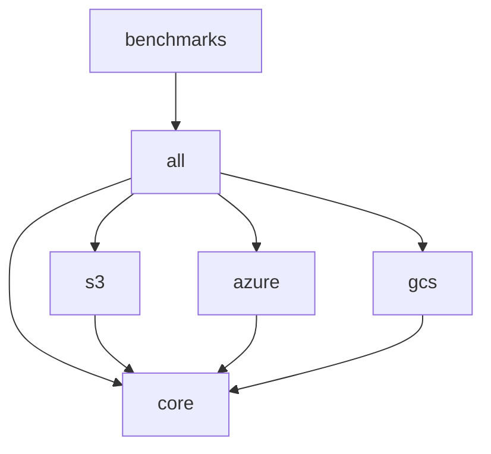

# Architecture

Deep dive into the design patterns and architectural decisions of the Tileverse Range Reader library.

## The Architectural Gap We Fill

### The Fragmented State of Java Geospatial I/O

The Java geospatial ecosystem has suffered from a critical architectural gap: **the lack of a unified, lightweight abstraction for remote range-based I/O**. This has led to repeated, incompatible solutions across the ecosystem:

| Library | Custom I/O Abstraction | Cloud Support | Reusability |
|---------|------------------------|---------------|-------------|
| **imageio-ext** | `RangeReader` SPI | HTTP, S3, GCS, Azure | Internal only |
| **netCDF-Java** | `cdms3://` protocol | S3-compatible | Internal only |
| **simonpoole/pmtiles-reader** | `FileChannel` wrapper | User-implemented | Requires custom code |
| **Apache Parquet** | `SeekableInputStream` | User-implemented | Complex to implement |

Each library has essentially **re-invented the same wheel**, creating:
- **Code duplication** across the ecosystem
- **Inconsistent APIs** for similar operations  
- **High barriers to entry** for new format libraries
- **Vendor lock-in** to specific cloud providers

### Our Solution: The Missing Middle Layer

Tileverse Range Reader provides the **unified abstraction layer** that the Java ecosystem has been missing—comparable to Python's **fsspec** library. We enable:

```java
// One interface, any backend
RangeReader reader = createReader(uri);  // Works with s3://, https://, file://
ByteBuffer data = reader.readRange(offset, length);  // Same operation everywhere
```

This architectural foundation allows format libraries to focus on **parsing logic** instead of **I/O plumbing**.

## Core Design Patterns

The library is built on proven architectural patterns that provide flexibility, performance, and maintainability.

### Decorator Pattern

The primary architectural pattern enabling composable functionality:

```java
// ⚠️ CRITICAL: Decorator order matters for optimal performance!
// BlockAlignedRangeReader must ALWAYS wrap caching decorators
RangeReader reader = 
    BlockAlignedRangeReader.builder()          // ← Outermost: aligns requests  
        .delegate(CachingRangeReader.builder(   // ← Memory caching (non-overlapping)
            BlockAlignedRangeReader.builder()   // ← Aligns for disk cache
                .delegate(DiskCachingRangeReader.builder(  // ← Persistent caching
                    S3RangeReader.builder()     // ← Base implementation
                        .uri(uri)
                        .build())
                    .build())
                .blockSize(1024 * 1024)         // ← 1MB blocks for disk
                .build())
            .build())
        .blockSize(64 * 1024)                   // ← 64KB blocks for memory
        .build();
```

#### Benefits

- **Composability**: Mix and match optimizations
- **Single Responsibility**: Each decorator has one purpose
- **Runtime Configuration**: Stack decorators based on use case
- **Extensibility**: Easy to add new decorators

#### Implementation Details

All decorators extend `AbstractRangeReader` and implement the same interface:

```java
public class CachingRangeReader extends AbstractRangeReader {
    private final RangeReader delegate;  // Wrapped reader
    private final Cache<RangeKey, ByteBuffer> cache;
    
    @Override
    protected int readRangeNoFlip(long offset, int actualLength, ByteBuffer target) {
        // Check cache first, delegate on miss
        return cachedOrDelegate(offset, actualLength, target);
    }
}
```

### Template Method Pattern

`AbstractRangeReader` implements the Template Method pattern for consistent behavior:

```java
public abstract class AbstractRangeReader implements RangeReader {
    
    // Template method - final to prevent override
    @Override
    public final int readRange(long offset, int length, ByteBuffer target) {
        // 1. Parameter validation (consistent across all implementations)
        validateParameters(offset, length, target);
        
        // 2. Boundary checking (handles EOF scenarios)
        int actualLength = calculateActualLength(offset, length);
        
        // 3. Buffer preparation
        int initialPosition = target.position();
        
        // 4. Delegate to implementation (hook method)
        int bytesRead = readRangeNoFlip(offset, actualLength, target);
        
        // 5. Buffer post-processing (flip for consumption)
        prepareBufferForReading(target, initialPosition);
        
        return bytesRead;
    }
    
    // Hook method - implementations provide specific logic
    protected abstract int readRangeNoFlip(long offset, int actualLength, ByteBuffer target);
}
```

#### Benefits

- **Consistency**: All implementations behave identically
- **Validation**: Parameter checking happens once
- **Buffer Management**: Consistent buffer state handling
- **Error Handling**: Centralized error management

### Builder Pattern

The library uses type-safe builders for configuration:

```java
// Type-safe, fluent configuration
S3RangeReader reader = S3RangeReader.builder()
    .uri(URI.create("s3://bucket/key"))
    .region(Region.US_WEST_2)
    .credentialsProvider(credentialsProvider)
    .build();
```

#### Two Builder Approaches

1. **Individual Builders** (preferred):
   ```java
   S3RangeReader.builder()      // Type-specific
   HttpRangeReader.builder()    // Type-specific
   CachingRangeReader.builder() // Type-specific
   ```

2. **Unified Builder** (evolving):
   ```java
   RangeReaderBuilder.s3(uri)      // Generic
       .withCredentials(creds)
       .build()
   ```

## Module Architecture

### Layered Architecture

```
┌─────────────────────────────────────┐
│           Application Layer          │
├─────────────────────────────────────┤
│         Decorator Layer             │
│  ┌─────┐ ┌─────┐ ┌──────────────┐   │
│  │Cache│ │Disk │ │Block Aligned │   │
│  └─────┘ └─────┘ └──────────────┘   │
├─────────────────────────────────────┤
│        Implementation Layer         │
│  ┌────┐ ┌────┐ ┌──┐ ┌───┐ ┌───┐   │
│  │File│ │HTTP│ │S3│ │Az │ │GCS│   │
│  └────┘ └────┘ └──┘ └───┘ └───┘   │
├─────────────────────────────────────┤
│          Interface Layer            │
│         RangeReader Interface       │
└─────────────────────────────────────┘
```

### Module Dependencies



## Thread Safety Design

### Requirements

All `RangeReader` implementations MUST be thread-safe to support:

- Server environments (multiple request threads)
- Parallel processing frameworks
- Concurrent batch operations

### Implementation Strategies

#### Immutable State

```java
public class FileRangeReader extends AbstractRangeReader {
    // All fields are immutable after construction
    private final Path filePath;
    private final long fileSize;     // Cached at construction
    private final String identifier; // Computed once
    
    // Thread-safe because state is immutable
}
```

#### Concurrent Collections

```java
public class CachingRangeReader extends AbstractRangeReader {
    // Caffeine cache is thread-safe
    private final Cache<RangeKey, ByteBuffer> cache;
    
    @Override
    protected int readRangeNoFlip(long offset, int length, ByteBuffer target) {
        // Cache operations are thread-safe
        return cache.get(key, this::loadFromDelegate);
    }
}
```

#### Per-Operation Resources

```java
public class HttpRangeReader extends AbstractRangeReader {
    // Shared configuration (immutable)
    private final URI uri;
    private final HttpAuthentication auth;
    
    @Override
    protected int readRangeNoFlip(long offset, int length, ByteBuffer target) {
        // Create new HTTP connection per request (thread-safe)
        try (HttpClient client = createClient()) {
            return performRequest(client, offset, length, target);
        }
    }
}
```

## Performance Architecture

### Multi-Level Caching Strategy

```
Request → Memory Cache → Disk Cache → Base Reader → Source
   ↓         ↓             ↓           ↓
 ~1ms      ~10ms        ~100ms     ~1000ms
```

#### Cache Hierarchy

1. **L1 (Memory)**: Fastest access, limited capacity
2. **L2 (Disk)**: Persistent, larger capacity
3. **L3 (Network/Disk)**: Authoritative source

#### Block Alignment Benefits

```java
// Without block alignment: 3 separate requests
reader.readRange(100, 50);   // Request 1
reader.readRange(200, 50);   // Request 2  
reader.readRange(300, 50);   // Request 3

// With 1KB block alignment: 1 request covers all
blockAligned.readRange(100, 50);  // Fetches block 0-1024
blockAligned.readRange(200, 50);  // Cache hit
blockAligned.readRange(300, 50);  // Cache hit
```

### Memory Management

#### Buffer Reuse

```java
// Efficient: Reuse buffers
ByteBuffer buffer = ByteBuffer.allocate(8192);
for (long offset = 0; offset < size; offset += 8192) {
    buffer.clear();
    reader.readRange(offset, 8192, buffer);
    // Buffer is already flipped and ready to read
    processBuffer(buffer);
}
```

#### Cache Sizing

- **Entry-based**: Limits number of cached ranges
- **Memory-based**: Limits total memory usage
- **Adaptive**: Uses soft references for GC management

## Error Handling Architecture

### Exception Hierarchy

```
IOException
├── FileNotFoundException
├── AccessDeniedException  
├── NoSuchFileException
└── Cloud-specific exceptions
    ├── S3Exception
    ├── BlobStorageException
    └── GoogleCloudStorageException
```

### Resilience Patterns

#### Graceful Degradation

```java
public class DiskCachingRangeReader extends AbstractRangeReader {
    @Override
    protected int readRangeNoFlip(long offset, int length, ByteBuffer target) {
        try {
            return readFromCache(offset, length, target);
        } catch (NoSuchFileException cacheFileDeleted) {
            // Graceful fallback to delegate
            cache.invalidate(key);
            return delegate.readRange(offset, length, target);
        }
    }
}
```

#### Retry Logic

```java
public class HttpRangeReader extends AbstractRangeReader {
    @Override
    protected int readRangeNoFlip(long offset, int length, ByteBuffer target) {
        for (int attempt = 0; attempt < maxRetries; attempt++) {
            try {
                return performRequest(offset, length, target);
            } catch (SocketTimeoutException e) {
                if (attempt == maxRetries - 1) throw e;
                delay(retryDelay * (1 << attempt)); // Exponential backoff
            }
        }
    }
}
```

## Extension Architecture

### Adding New Data Sources

1. **Extend AbstractRangeReader**:
   ```java
   public class MyRangeReader extends AbstractRangeReader {
       @Override
       protected int readRangeNoFlip(long offset, int length, ByteBuffer target) {
           // Source-specific implementation
       }
   }
   ```

2. **Implement Builder Pattern**:
   ```java
   public static class Builder {
       public MyRangeReader build() {
           return new MyRangeReader(/* parameters */);
       }
   }
   ```

3. **Add to Factory** (optional):
   ```java
   public class RangeReaderFactory {
       public static RangeReader create(URI uri) {
           if ("myprotocol".equals(uri.getScheme())) {
               return MyRangeReader.builder().uri(uri).build();
           }
           // ... other protocols
       }
   }
   ```

### Adding New Decorators

```java
public class CompressionRangeReader extends AbstractRangeReader {
    private final RangeReader delegate;
    private final CompressionAlgorithm algorithm;
    
    @Override
    protected int readRangeNoFlip(long offset, int length, ByteBuffer target) {
        // 1. Read compressed data from delegate
        ByteBuffer compressed = readCompressed(offset, length);
        
        // 2. Decompress into target buffer
        return decompress(compressed, target);
    }
}
```

## Testing Architecture

### Test Hierarchy

```
AbstractRangeReaderIT     ← Base integration test
├── FileRangeReaderIT     ← File system tests
├── HttpRangeReaderIT     ← HTTP server tests
├── S3RangeReaderIT       ← S3 API tests
├── AzureBlobRangeReaderIT ← Azure tests
└── GoogleCloudStorageRangeReaderIT ← GCS tests
```

### TestContainers Integration

```java
@Testcontainers
public class S3RangeReaderIT extends AbstractRangeReaderIT {
    @Container
    static LocalStackContainer localstack = new LocalStackContainer(...)
        .withServices(LocalStackContainer.Service.S3);
    
    @Override
    protected RangeReader createBaseReader() {
        return S3RangeReader.builder()
            .endpointOverride(localstack.getEndpoint())
            .build();
    }
}
```

### Benefits

- **Realistic Testing**: Real service APIs via containers
- **Isolation**: Each test runs in clean environment  
- **Reproducibility**: Same containers across environments
- **CI/CD Ready**: Containers work in GitHub Actions

## Performance Monitoring

### Built-in Metrics

```java
// Cache statistics
CacheStats stats = cachingReader.getCacheStats();
double hitRate = stats.hitRate();
long missCount = stats.missCount();

// Source identification for debugging
String sourceId = reader.getSourceIdentifier();
// Examples:
// "file:///path/to/file.bin"
// "memory-cached:disk-cached:s3://bucket/key"
```

### JMH Benchmarks

The `benchmarks` module provides comprehensive performance analysis:

```java
@Benchmark
public ByteBuffer readRange() {
    return reader.readRange(offset, length);
}

// Run with: java -jar benchmarks.jar -prof gc
```

## Security Architecture

### Credential Management

- **No Storage**: Credentials never stored in reader instances
- **Provider Pattern**: Uses credential providers (AWS, Azure, GCS)
- **Least Privilege**: Readers only need read permissions

### Network Security

- **TLS by Default**: HTTPS for all network communications
- **Certificate Validation**: Proper SSL/TLS validation
- **Proxy Support**: Corporate proxy configuration

## Future Architecture Considerations

### Async Support

Future versions may support non-blocking I/O:

```java
// Potential future API
CompletableFuture<ByteBuffer> readRangeAsync(long offset, int length);
```

### Streaming Support

Support for reactive streams:

```java
// Potential future API  
Publisher<ByteBuffer> streamRanges(long offset, int length, int chunkSize);
```

### Pluggable Authentication

More flexible authentication system:

```java
// Potential future API
reader.withAuthProvider(AuthProvider.oauth2(clientId, secret));
```

## Best Practices

### ⚠️ CRITICAL: Decorator Ordering

**BlockAlignedRangeReader must ALWAYS wrap caching decorators to prevent overlapping ranges!**

```
BlockAlignedRangeReader     ← Outermost: aligns requests (64KB)
    ↓
CachingRangeReader          ← Memory cache (non-overlapping 64KB blocks)
    ↓
BlockAlignedRangeReader     ← Aligns for disk cache (1MB)  
    ↓
DiskCachingRangeReader      ← Persistent storage (non-overlapping 1MB blocks)
    ↓
BaseReader                  ← Source-specific implementation
```

**Why this order matters:**

1. **Prevents cache pollution**: Each caching layer stores non-overlapping, aligned blocks
2. **Optimal memory usage**: No duplicate data across different alignments
3. **Maximum cache efficiency**: Clean cache hits without range overlaps
4. **Different block sizes**: Memory cache (64KB) vs disk cache (1MB) for optimal performance

**❌ WRONG order causes problems:**
- Overlapping ranges in cache (e.g., bytes 0-100 and bytes 64-164 both cached)
- Wasted memory and storage
- Poor cache hit ratios
- Degraded performance

### Resource Management

**For short-term usage (preferred):**
```java
// Use try-with-resources for short-term access
try (RangeReader reader = createReader()) {
    ByteBuffer data = reader.readRange(offset, length);
    processData(data);
} // Automatically closed when done
```

**For long-term usage (instance variables):**
```java
public class DataProcessor {
    private final RangeReader reader;
    
    public DataProcessor(RangeReader reader) {
        this.reader = reader;  // Long-lived instance
    }
    
    public void processChunk(long offset, int length) {
        ByteBuffer data = reader.readRange(offset, length);
        // Process data...
    }
    
    @Override
    public void close() throws IOException {
        reader.close();  // ⚠️ Don't forget to close!
    }
}
```

**Key principle:** RangeReaders must be closed to release resources (connection pools, file handles, cache cleanup), but the timing depends on usage pattern.

### Error Handling

```java
// Handle specific exceptions appropriately
try {
    ByteBuffer data = reader.readRange(offset, length);
} catch (NoSuchFileException e) {
    // File/object doesn't exist
} catch (AccessDeniedException e) {
    // Permission denied
} catch (IOException e) {
    // Other I/O error
}
```

## Next Steps

- **[Testing](testing.md)**: Understand the testing strategy
- **[Performance](performance.md)**: Learn about optimization techniques  
- **[Contributing](contributing.md)**: Guidelines for extending the architecture