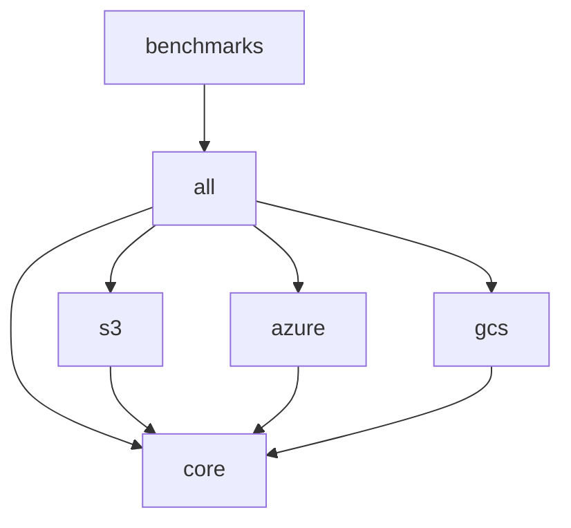

# Architecture

This document provides a deep dive into the design patterns, architectural decisions, and technical implementation of the Tileverse Range Reader library.

## The Architectural Gap We Fill

### The Fragmented State of Java Geospatial I/O

The Java geospatial ecosystem has suffered from a critical architectural gap: **the lack of a unified, lightweight abstraction for remote range-based I/O**. This has led to repeated, incompatible solutions across the ecosystem:

| Library | Custom I/O Abstraction | Cloud Support | Reusability |
|---------|------------------------|---------------|-------------|
| **imageio-ext** | `RangeReader` SPI | HTTP, S3, GCS, Azure | Internal only |
| **netCDF-Java** | `cdms3://` protocol | S3-compatible | Internal only |
| **simonpoole/pmtiles-reader** | `FileChannel` wrapper | User-implemented | Requires custom code |
| **Apache Parquet** | `SeekableInputStream` | User-implemented | Complex to implement |

Each library has essentially **re-invented the same wheel**, creating:
- **Code duplication** across the ecosystem
- **Inconsistent APIs** for similar operations  
- **High barriers to entry** for new format libraries
- **Vendor lock-in** to specific cloud providers

### Our Solution: The Missing Middle Layer

Tileverse Range Reader provides the **unified abstraction layer** that the Java ecosystem has been missing—comparable to Python's **fsspec** library. We enable:

```java
// One interface, any backend
RangeReader reader = createReader(uri);  // Works with s3://, https://, file://
ByteBuffer data = reader.readRange(offset, length);  // Same operation everywhere
```

This architectural foundation allows format libraries to focus on **parsing logic** instead of **I/O plumbing**.


## Module Architecture

The Tileverse Range Reader library follows a **modular architecture** that enables incremental adoption and minimal dependency footprint. Each module serves a specific purpose and can be used independently or in combination with others.


### Module Dependencies



### Core Module (`tileverse-rangereader-core`)

**Purpose**: Provides fundamental abstractions, base implementations, and decorators.

**Key Responsibilities**:
- Core `RangeReader` interface definition
- Abstract base classes with common functionality
- Local file system implementation (`FileRangeReader`)
- HTTP/HTTPS implementation (`HttpRangeReader`)
- Performance decorators (caching, disk caching)
- Authentication framework for HTTP sources

### Cloud Provider Modules (`s3`, `azure`, `gcs`)

**Purpose**: Provider-specific implementations for AWS, Azure, and Google Cloud.

**Key Features**:
- Native SDK integration
- Full credential chain support
- Provider-specific optimizations

### All Module (`tileverse-rangereader-all`)

**Purpose**: Convenience aggregation module that provides unified access to all functionality.

## Component View


### Component Responsibilities

| Component | Responsibility |
|-----------|---------------|
| **RangeReader** | Define the contract for reading byte ranges |
| **RangeReaderProvider** | Service Provider Interface for discovering and creating RangeReader instances |
| **RangeReaderFactory** | Discovers and selects the appropriate RangeReaderProvider to create RangeReader instances |
| **AbstractRangeReader** | Provide common functionality and validation |
| **FileRangeReader** | Read ranges from local files using NIO |
| **HttpRangeReader** | Read ranges from HTTP servers with authentication |
| **S3RangeReader** | Read ranges from Amazon S3 and S3-compatible storage |
| **AzureBlobRangeReader** | Read ranges from Azure Blob Storage |
| **GoogleCloudStorageRangeReader** | Read ranges from Google Cloud Storage |
| **CachingRangeReader** | Provide in-memory caching with configurable policies |
| **DiskCachingRangeReader** | Provide persistent disk-based caching |

## Core Design Patterns

The library is built on proven architectural patterns that provide flexibility, performance, and maintainability.

### Decorator Pattern

The primary architectural pattern enabling composable functionality:

```java
// ✅ CORRECT: Proper decorator stacking order
RangeReader reader = 
    CachingRangeReader.builder(             // ← Outermost: memory caching
        DiskCachingRangeReader.builder(     // ← Persistent caching
            S3RangeReader.builder()         // ← Base implementation
                .uri(uri)
                .build())
            .maxCacheSizeBytes(1024 * 1024 * 1024)  // 1GB disk cache
            .build())
        .maximumSize(1000)                  // 1000 entries in memory
        .build();
```

### Template Method Pattern

`AbstractRangeReader` implements the Template Method pattern for consistent behavior:

```java
public abstract class AbstractRangeReader implements RangeReader {
    
    // Template method - final to prevent override
    @Override
    public final int readRange(long offset, int length, ByteBuffer target) {
        // 1. Parameter validation (consistent across all implementations)
        validateParameters(offset, length, target);
        
        // 2. Boundary checking (handles EOF scenarios)
        int actualLength = calculateActualLength(offset, length);
        
        // 3. Buffer preparation
        int initialPosition = target.position();
        
        // 4. Delegate to implementation (hook method)
        int bytesRead = readRangeNoFlip(offset, actualLength, target);
        
        // 5. Buffer post-processing (flip for consumption)
        prepareBufferForReading(target, initialPosition);
        
        return bytesRead;
    }
    
    // Hook method - implementations provide specific logic
    protected abstract int readRangeNoFlip(long offset, int actualLength, ByteBuffer target);
}
```

### Builder Pattern

The library uses type-safe builders for configuration:

```java
// Type-safe, fluent configuration
S3RangeReader reader = S3RangeReader.builder()
    .uri(URI.create("s3://bucket/key"))
    .region(Region.US_WEST_2)
    .credentialsProvider(credentialsProvider)
    .build();
```

## Runtime View

The runtime view describes the dynamic behavior of the library.

### Basic File Range Reading


### HTTP Range Reading with Authentication


### Multi-Level Caching Scenario


## Thread Safety Design

All `RangeReader` implementations MUST be thread-safe. This is achieved through:
- **Immutable State**: Fields are final and set at construction.
- **Concurrent Collections**: Using thread-safe caches like Caffeine.
- **Per-Operation Resources**: Creating new resources (like HTTP connections) for each request.

## Performance Architecture

### Multi-Level Caching Strategy

`Request → Memory Cache → Disk Cache → Base Reader → Source`

- **L1 (Memory)**: Fastest access, limited capacity.
- **L2 (Disk)**: Persistent, larger capacity.
- **L3 (Network/Disk)**: Authoritative source.

### Read Optimization

The library optimizes read patterns through intelligent caching strategies. Memory caching provides fast access to frequently used ranges, while disk caching offers persistence for large datasets across application sessions.

## Error Handling Architecture

A standard `IOException` hierarchy is used, with specific exceptions for cloud providers. Resilience patterns like graceful degradation (e.g., handling a deleted cache file) and retry logic with exponential backoff are implemented.

## Extension Architecture

New data sources can be added by extending `AbstractRangeReader` and implementing the builder pattern. New decorators can be created by implementing the `RangeReader` interface and delegating to a wrapped reader.

### Service Provider Interface (SPI)

The Tileverse Range Reader library leverages the Java Service Provider Interface (SPI) to enable flexible and extensible discovery of `RangeReader` implementations. Instead of directly instantiating `RangeReader` classes, the `RangeReaderFactory` uses the SPI to find and load available `RangeReaderProvider` implementations at runtime.

**Key Concepts:**

-   **`RangeReaderProvider`**: This interface defines the contract for a service provider. Each concrete implementation (e.g., `FileRangeReaderProvider`, `S3RangeReaderProvider`) is responsible for:
    -   Identifying itself with a unique ID.
    -   Declaring its availability (e.g., checking for necessary system properties or environment variables).
    -   Specifying the URI schemes and hostname patterns it can process.
    -   Providing a factory method to create a `RangeReader` instance based on a `RangeReaderConfig`.
    -   Optionally, defining configuration parameters specific to its implementation.

-   **`RangeReaderFactory`**: This factory class is the entry point for obtaining `RangeReader` instances. It performs the following steps:
    1.  **Discovery**: Uses `java.util.ServiceLoader` to find all registered `RangeReaderProvider` implementations.
    2.  **Filtering**: Filters the discovered providers based on their `canProcess(RangeReaderConfig)` method, which checks the URI scheme and other static criteria.
    3.  **Disambiguation**: For ambiguous cases (e.g., multiple providers supporting HTTP/HTTPS), it employs a multi-step process:
        -   Checks for explicit provider IDs in the `RangeReaderConfig`.
        -   Analyzes URI hostname patterns to identify cloud-specific endpoints (e.g., Azure Blob Storage, AWS S3).
        -   Performs a `HEAD` request to the resource to inspect provider-specific HTTP headers (e.g., `x-ms-request-id` for Azure, `x-amz-request-id` for S3).
        -   Resolves remaining ambiguities by selecting the provider with the highest priority (lowest `getOrder()` value).
    4.  **Instantiation**: Once a single best provider is identified, it delegates the creation of the `RangeReader` to that provider.

**Adding a New Provider:**

To add support for a new data source or protocol, you need to:

1.  Implement the `RangeReaderProvider` interface.
2.  Create a `META-INF/services/io.tileverse.rangereader.spi.RangeReaderProvider` file in your JAR, listing the fully qualified name of your `RangeReaderProvider` implementation.
3.  Implement your specific `RangeReader` logic, typically by extending `AbstractRangeReader`.

This SPI mechanism ensures that the core library remains lightweight and extensible, allowing developers to easily integrate new storage backends without modifying the core codebase.

## Testing Architecture

A base integration test class, `AbstractRangeReaderIT`, is used for all implementations. [Testcontainers](https://www.testcontainers.org/) is used to run tests against real service APIs in Docker containers.
