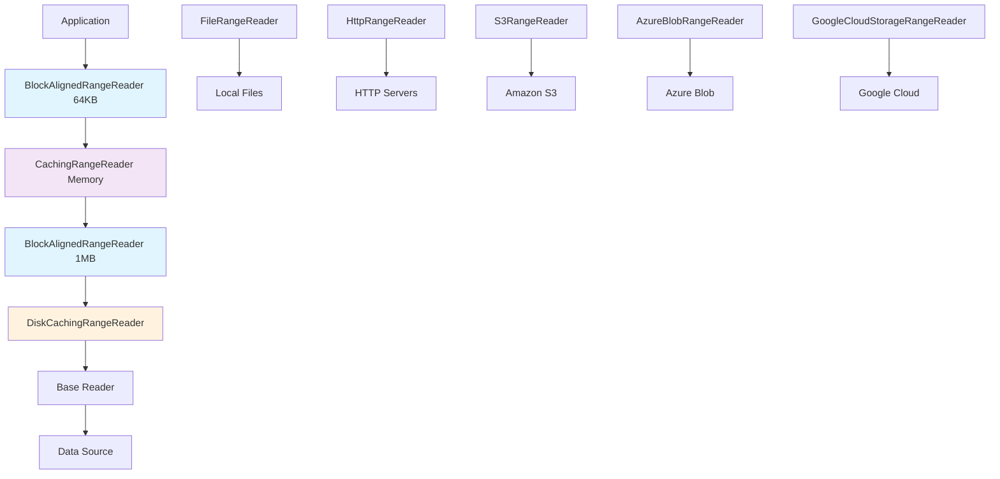

# Tileverse Range Reader

A high-performance Java library for reading byte ranges from various data sources including local files, HTTP servers, and cloud storage services.

## The Cloud-Native Geospatial Challenge

The geospatial data landscape has fundamentally shifted from traditional "download-and-process" workflows to **cloud-native** patterns. Modern formats like **Cloud Optimized GeoTIFF (COG)**, **PMTiles**, **GeoParquet**, **Zarr**, and **FlatGeobuf** are explicitly designed to leverage **HTTP range requests**, allowing applications to fetch only the specific byte ranges needed for a query rather than downloading entire multi-gigabyte files.

However, the Java ecosystem has suffered from **significant fragmentation** in this space. Each geospatial library has implemented its own isolated solution:
- **imageio-ext** developed its own `RangeReader` SPI for COG support
- **netCDF-Java** created the `cdms3://` protocol for Zarr access  
- **PMTiles readers** require custom `FileChannel` implementations
- **GeoParquet** libraries either rely on heavyweight Spark dependencies or embed entire databases via JNI

## Our Solution: A Unified I/O Foundation

Tileverse Range Reader provides the **missing architectural layer** that the Java geospatial ecosystem needs—a lightweight, extensible, and cloud-agnostic abstraction for range-based I/O operations. Think of it as Java's equivalent to Python's **fsspec** library.

Instead of every format library implementing its own cloud storage access, they can build on our unified foundation:

```java
// One abstraction, multiple backends
RangeReader reader = S3RangeReader.builder()
    .uri(URI.create("s3://bucket/data.pmtiles"))
    .build();

// Same interface works for any format that needs range access
ByteBuffer chunk = reader.readRange(offset, length);
```

## Key Features

### 🌐 **Multiple Data Sources**
- **Local Files**: Direct file system access via NIO channels
- **HTTP/HTTPS**: Range requests with comprehensive authentication support
- **Amazon S3**: Native S3 API with AWS SDK v2
- **Azure Blob Storage**: Azure SDK integration
- **Google Cloud Storage**: Google Cloud SDK support

### ⚡ **High Performance**
- **Multi-level Caching**: Memory + disk caching strategies
- **Block Alignment**: Optimized read patterns for cloud storage
- **Concurrent Access**: Thread-safe implementations for server environments
- **Efficient Buffering**: Zero-copy operations where possible

### 🔧 **Flexible Architecture**
- **Decorator Pattern**: Composable functionality through decorators
- **Builder APIs**: Fluent configuration interfaces
- **Extensible Design**: Easy to add new data sources and optimizations

### 🔐 **Comprehensive Authentication**
- **AWS Credentials**: Multiple credential providers
- **Azure Authentication**: SAS tokens, connection strings, Azure AD
- **HTTP Authentication**: Basic, Bearer, API Key, Digest, Custom Headers
- **Security Best Practices**: Secure credential handling

## Quick Start

### Installation

Add the dependency to your Maven project:

=== "All Modules"

    ```xml
    <dependency>
        <groupId>io.tileverse.rangereader</groupId>
        <artifactId>tileverse-rangereader-all</artifactId>
        <version>1.0-SNAPSHOT</version>
    </dependency>
    ```

=== "Core Only"

    ```xml
    <dependency>
        <groupId>io.tileverse.rangereader</groupId>
        <artifactId>tileverse-rangereader-core</artifactId>
        <version>1.0-SNAPSHOT</version>
    </dependency>
    ```

=== "S3 Module"

    ```xml
    <dependency>
        <groupId>io.tileverse.rangereader</groupId>
        <artifactId>tileverse-rangereader-s3</artifactId>
        <version>1.0-SNAPSHOT</version>
    </dependency>
    ```

### Basic Usage

```java
import io.tileverse.rangereader.*;
import java.nio.ByteBuffer;
import java.nio.file.Path;

// Reading from a local file
try (RangeReader reader = FileRangeReader.builder()
        .path(Path.of("data.bin"))
        .build()) {
    
    // Read first 1024 bytes
    ByteBuffer header = reader.readRange(0, 1024);
    
    // Read a specific section
    ByteBuffer chunk = reader.readRange(50000, 8192);
    
    // Get total file size
    long size = reader.size();
}
```

### Performance Optimization

For optimal performance with cloud storage, use the decorator pattern:

```java
// CORRECT: Multi-level caching with block alignment
// Block aligners should always wrap caching decorators to avoid overlapping ranges
try (RangeReader reader = 
        BlockAlignedRangeReader.builder()
            .delegate(CachingRangeReader.builder(
                BlockAlignedRangeReader.builder()
                    .delegate(DiskCachingRangeReader.builder(
                        S3RangeReader.builder()
                            .uri(URI.create("s3://bucket/data.bin"))
                            .build())
                        .maxCacheSizeBytes(1024 * 1024 * 1024) // 1GB disk cache
                        .build())
                    .blockSize(1024 * 1024) // 1MB blocks for disk cache
                    .build())
                .maximumSize(1000) // 1000 memory cache entries
                .build())
            .blockSize(64 * 1024) // 64KB blocks for memory cache
            .build()) {
    
    // Efficient range reads with optimal caching
    ByteBuffer data = reader.readRange(offset, length);
}
```

## Architecture

The library follows a layered architecture using the Decorator pattern:



### ⚠️ Critical: Decorator Order Matters

**BlockAlignedRangeReader must ALWAYS wrap caching decorators, never the reverse!**

```java
// ✅ CORRECT: Block aligners wrap caches
BlockAlignedRangeReader.builder()
    .delegate(CachingRangeReader.builder(baseReader).build())
    .blockSize(64 * 1024)
    .build()

// ❌ WRONG: Cache wraps block aligner (creates overlapping ranges)
CachingRangeReader.builder(
    BlockAlignedRangeReader.builder()
        .delegate(baseReader)
        .blockSize(64 * 1024)
        .build())
    .build()
```

**Why this matters:**
- **Overlapping ranges**: If caching wraps block alignment, the cache stores overlapping block-aligned ranges
- **Cache pollution**: Multiple cache entries for the same data at different alignments
- **Poor performance**: Increased memory usage and cache misses

**Advanced pattern for different block sizes:**
```java
// Different block sizes for memory (64KB) vs disk (1MB) caching
BlockAlignedRangeReader.builder()
    .delegate(CachingRangeReader.builder(          // 64KB blocks cached in memory
        BlockAlignedRangeReader.builder()
            .delegate(DiskCachingRangeReader.builder(  // 1MB blocks cached on disk
                baseReader)
                .build())
            .blockSize(1024 * 1024)                // 1MB for disk cache
            .build())
        .build())
    .blockSize(64 * 1024)                         // 64KB for memory cache
    .build()
```

## Getting Started

Choose your path based on your role:

<div class="grid cards" markdown>

-   :material-rocket-launch: **User Guide**

    ---

    Learn how to use the library in your applications

    [:octicons-arrow-right-24: Get Started](user-guide/index.md)

-   :material-code-braces: **Developer Guide**

    ---

    Contribute to the project or understand the internals

    [:octicons-arrow-right-24: Development](developer-guide/index.md)

-   :material-book-open-page-variant: **Technical Documentation**

    ---

    Detailed architecture and design documentation

    [:octicons-arrow-right-24: Architecture](arc42/index.md)

</div>

## Requirements

- **Java 17+**: Minimum Java version required
- **Maven 3.9+**: For building from source
- **Docker**: For running benchmarks and integration tests

## Performance

The library is designed for high-performance scenarios:

- **Concurrent Access**: All implementations are thread-safe
- **Efficient Caching**: Multi-level caching reduces redundant requests
- **Block Alignment**: Optimizes cloud storage access patterns
- **Zero-Copy**: Minimizes data copying where possible

Benchmarks show significant performance improvements with proper caching configuration:

| Scenario | Without Caching | With Memory Cache | With Disk + Memory |
|----------|-----------------|-------------------|---------------------|
| Local Access | 100% | 102% | 101% |
| HTTP Access | 100% | 400% | 350% |
| S3 Access | 100% | 800% | 600% |

## License

Licensed under the Apache License, Version 2.0. See [LICENSE](https://github.com/tileverse-io/tileverse-rangereader/blob/main/LICENSE) for details.

## Support

- 📚 [Documentation](index.md)
- 🐛 [Issues](https://github.com/tileverse-io/tileverse-rangereader/issues)
- 💬 [Discussions](https://github.com/tileverse-io/tileverse-rangereader/discussions)
- 🌐 [Tileverse.io](https://tileverse.io)